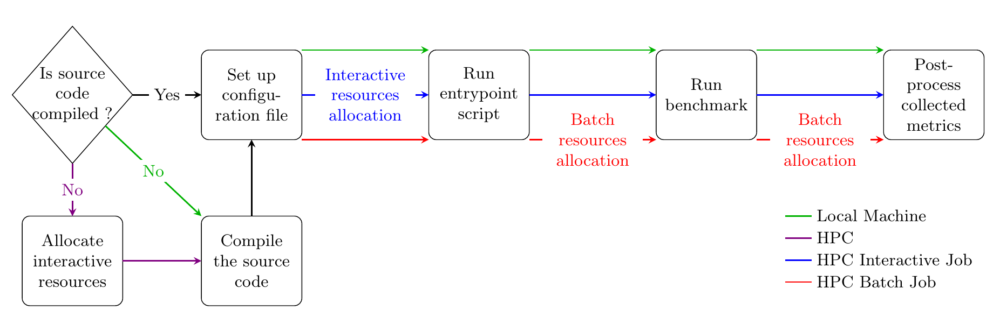
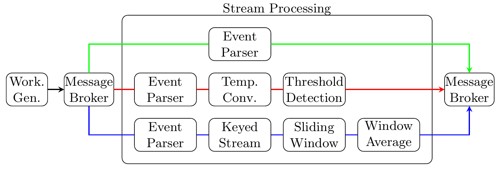

<!-- PROJECT LOGO -->
<br />
<div align="center">
  <a href="https://github.com/apurvkulkarni7/SProBench">
    
  </a>
  <h1 align="center">
    Streaming Processing Benchmark for High Performance Computing
  </h1>
  
  <p align="center">

  <br />
    <a href="https://github.com/apurvkulkarni7/">View Demo</a> |
    <a href="https://github.com/apurvkulkarni7/SProBench/issues">Report Bug</a> |
    <a href="https://github.com/apurvkulkarni7/SProBench/issues">Request Feature</a>
  </p>
</div>


<!-- TABLE OF CONTENTS -->
<details>
  <summary>Table of Contents</summary>
  <ol>
    <li>
      <a href="#about-the-project">About The Project</a>
    </li>
    <li>
      <a href="#software-stack">Software Stack</a>
    </li>
    <li>
      <a href="#getting-started">Getting Started</a>
      <ul>
        <li><a href="#prerequisites">Prerequisites</a></li>
        <li><a href="#installation">Installation</a></li>
      </ul>
    </li>
    <li><a href="#usage">Usage</a></li>
    <li><a href="#about-benchmark">Benchmark</a>
      <ul>
        <li><a href="#workflow">Workflow</a></li>
        <li><a href="#data-loading">Data Loading</a></li>
      </ul>
    </li>
    <li><a href="#roadmap">Roadmap</a></li>
    <li><a href="#contributing">Contributing</a></li>
    <li><a href="#license">License</a></li>
    <li><a href="#contact">Contact</a></li>
    <li><a href="#acknowledgments">Acknowledgments</a></li>
  </ol>
</details>

<!-- ABOUT THE PROJECT -->
## About The Project

This is benchmark designed to understand performance of different streaming frameworks on Slurm based HPC systems.

<p align="right">(<a href="#readme-top">back to top</a>)</p>


## Software Stack

Following software and frameworks are used to build the benchmark

### Core software

| Technology | Version  | Description |
| --- |  --- | --- | 
| [![Java][Java-image]][Java-url] | 11 | Core programming language |
|[![Apache Maven][Maven-image]][Maven-url] | 3.9.6 | Build automation tool for Java application |

### Message broker

| Technology | Version  | Description |
| --- |  --- | --- | 
|[![Apache Kafka][Kafka-image]][Kafka-url] | 3.6.1 | Message broker for distributed streaming and event-driven architectures |

### Streaming software

| Technology | Version  | Description | Status |
| --- |  --- | --- | --- |
| [![Apache Flink][Flink-image]][Flink-url] | 1.19.1 | Distributed streaming engine | Available |
|[![Apache Spark][Spark-image]][Spark-url] | 3.5.0 | Unified streaming engine | Available |
| [![Apache Kafka][Kafka-image]][Kafka-url] | 3.6.1 | Distributed streaming platform | Available |
| [![Windflow][WindFlow-image]][WindFlow-url] | 4.2.2 | | [WIP] |

### System support

| System | Os/Software version | Description | Status |
| --- |  --- | --- | --- |
| Local machine | Linux |  | Available |
| SLURM based HPC | Linux/slurm-23.03 |  | Available |

<p align="right">(<a href="#readme-top">back to top</a>)</p>

## Getting Started

### Prerequisites and Installation

You can setup the benchmark on required syetem and also check if the compatible 
frameworks are installed using:
```sh
./runner.sh --setup --system_type localmachine
```
You can use the provided default configuration [file](./default_config.yaml) for
the inspiration for creating own configuration file.

<p align="right">(<a href="#readme-top">back to top</a>)</p>

## Usage

You can use `runner.sh` scritp to start the benchmark in following ways:
```bash
$ ./runner.sh -h
Usage: runner.sh [OPTIONS]

Description:
  The entry point script that controls the installation and execution
  of the benchmark.

Options:
  --setup             Setup the benchmark to install required software
                      Requires --system_type and --conf_file
  --system_type, -s   The system type where the benchmark is running
                      (localmachine, slurm_interactive,slurm_batch)
  --output_dir, -o    The directory where benchmark output will be 
                      stored
  --conf_file, -c     The path to the experiment main configuration
                      file

Usage examples:
  Setup : runner.sh --setup --system_type <type> --conf_file <file>
  Run   : runner.sh --system_type <type> [options]

```

Once the setup is complete, edit the configuration file as per requirement. Then
the benchmark can be started as follows (minimal working example):

```bash
./runner.sh --system_type localmachine
```

<!-- BENCHMARK -->
## About Benchmark

### Workflow
Benhcmark consist of following workflow:



and consist of following three pipelines




<p align="right">(<a href="#readme-top">back to top</a>)</p>

<!-- ROADMAP -->
## Roadmap
- [ ] Complete support for 
  - [ ] Windflow
  - [ ] Apache Storm
  - [ ] Hazelcast
  - [ ] Nebulastream
  - [ ] Apache Beam
- [ ] Add support for other sytems like Torch
- [ ] Add support for other data processing pipelines that are ML/DL focussed


See the open issues for a full list of proposed features (and known issues).

<p align="right">(<a href="#readme-top">back to top</a>)</p>

<!-- CONTRIBUTING -->
## Contributing

Contributions are what make the open source community such an amazing place to learn, inspire, and create. Any contributions you make are **greatly appreciated**.

If you have a suggestion that would make this better, please fork the repo and create a pull request. You can also simply open an issue with the tag "enhancement".
Don't forget to give the project a star! Thanks again!

1. Fork the Project
2. Create your Feature Branch (`git checkout -b feature/AmazingFeature`)
3. Commit your Changes (`git commit -m 'Add some AmazingFeature'`)
4. Push to the Branch (`git push origin feature/AmazingFeature`)
5. Open a Pull Request

<p align="right">(<a href="#readme-top">back to top</a>)</p>


<!-- LICENSE -->
## License

Distributed under the **GNU GENERAL PUBLIC LICENSE V3**. See [LICENSE](./LICENSE) for more information.

<p align="right">(<a href="#readme-top">back to top</a>)</p>


<!-- ACKNOWLEDGMENTS -->
## Acknowledgments

* [ScaDS.AI](https://scads.ai)

<p align="right">(<a href="#readme-top">back to top</a>)</p>


<!-- MARKDOWN LINKS & IMAGES -->
<!-- https://www.markdownguide.org/basic-syntax/#reference-style-links -->

[contributors-shield]: https://img.shields.io/github/contributors/othneildrew/Best-README-Template.svg?style=for-the-badge
[contributors-url]: https://github.com/othneildrew/Best-README-Template/graphs/contributors
[forks-shield]: https://img.shields.io/github/forks/othneildrew/Best-README-Template.svg?style=for-the-badge
[forks-url]: https://github.com/othneildrew/Best-README-Template/network/members
[stars-shield]: https://img.shields.io/github/stars/othneildrew/Best-README-Template.svg?style=for-the-badge
[stars-url]: https://github.com/othneildrew/Best-README-Template/stargazers
[issues-shield]: https://img.shields.io/github/issues/othneildrew/Best-README-Template.svg?style=for-the-badge
[issues-url]: https://github.com/othneildrew/Best-README-Template/issues
[license-shield]: https://img.shields.io/github/license/othneildrew/Best-README-Template.svg?style=for-the-badge
[license-url]: https://github.com/othneildrew/Best-README-Template/blob/master/LICENSE.txt

[Java-image]: https://img.shields.io/badge/Java-grey?style=for-the-badge&logo=java
[Java-url]: https://www.java.com/
[Maven-image]: https://img.shields.io/badge/Apache_Maven-grey?style=for-the-badge&logo=apachemaven
[Maven-url]: https://maven.apache.org/
[Flink-image]: https://img.shields.io/badge/Apache_Flink-grey?style=for-the-badge&logo=apacheflink
[Flink-url]: https://flink.apache.org/
[Spark-image]: https://img.shields.io/badge/Apache_Spark-grey?style=for-the-badge&logo=apachespark
[Spark-url]: https://spark.apache.org/
[Kafka-image]: https://img.shields.io/badge/Apache_Kafka-grey?style=for-the-badge&logo=apachekafka
[Kafka-url]: https://kafka.apache.org/
[WindFlow-image]: https://img.shields.io/badge/WindFlow-grey?style=for-the-badge&logo=windflow
[WindFlow-url]: https://github.com/ParaGroup/WindFlow