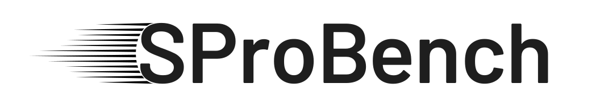

<!-- PROJECT LOGO -->
<br />
<div align="center">
  <a href="https://github.com/apurvkulkarni7/SProBench">
    
  </a>
  <h1 align="center">
    Streaming Processing Benchmark for High Performance Computing
  </h1>
  

  <p align="center">

  <br />
    <a href="https://github.com/apurvkulkarni7/">View Demo</a> |
    <a href="https://github.com/apurvkulkarni7/SProBench/issues">Report Bug</a> |
    <a href="https://github.com/apurvkulkarni7/SProBench/issues">Request Feature</a>
  </p>
</div>


<!-- TABLE OF CONTENTS -->
<details>
  <summary>Table of Contents</summary>
  <ol>
    <li>
      <a href="#about-the-project">About The Project</a>
      <ul>
        <li><a href="#built-with">Built With</a></li>
      </ul>
    </li>
    <li>
      <a href="#getting-started">Getting Started</a>
      <ul>
        <li><a href="#prerequisites">Prerequisites</a></li>
        <li><a href="#installation">Installation</a></li>
      </ul>
    </li>
    <li><a href="#usage">Usage</a></li>
    <li><a href="#about-benchmark">Benchmark</a>
      <ul>
        <li><a href="#workflow">Workflow</a></li>
        <li><a href="#data-loading">Data Loading</a></li>
      </ul>
    </li>
    <li><a href="#roadmap">Roadmap</a></li>
    <li><a href="#contributing">Contributing</a></li>
    <li><a href="#license">License</a></li>
    <li><a href="#contact">Contact</a></li>
    <li><a href="#acknowledgments">Acknowledgments</a></li>
  </ol>
</details>

<!-- ABOUT THE PROJECT -->
## About The Project

This is benchmark designed to understand performance of streaming framework on Slurm based HPC system. This is designed keeping all the good practices used in modern benchmarks.

### Why do we need this benchmark ?
- This benchmark designed to be run on SLURM based system. Such benchmarks are curretnly very old or don't consider the updated version of frameworks
- [WIP] This benchmark consists of not only Java based frameworks but also C++ based frameworks. Such versitality is not suported in any other benchmarks
- [WIP] This benchmark supports differen loading conditions (constant, periodic and burst) which is currently not supported by many benchmarks
- Can be easily integrated with monitoring tools used by ZIH HPC systems (in post-processing phase).
- And many more...


<p align="right">(<a href="#readme-top">back to top</a>)</p>


### Built With

Following frameworks are used to build the benchmark

[![Java][Java-image]][Java-url]\
[![Apache Maven][Maven-image]][Maven-url]\
[![Apache Flink][Flink-image]][Flink-url]\
[![Apache Spark][Spark-image]][Spark-url][WIP]\
[![Apache Kafka][Kafka-image]][Kafka-url][WIP]\
[![Windflow][WindFlow-image]][WindFlow-url][WIP]

<p align="right">(<a href="#readme-top">back to top</a>)</p>


<!-- GETTING STARTED -->
## Getting Started

### Prerequisites

You can check if the compatible frameworks are installed using:
```sh
./runner.sh -t CHECK -c <your-config-file>
```
You can use the provided default configuration [file](./default_config.yaml) for the inspiration for creating own configuration file.

### Installation [WIP]

<!-- USAGE -->
## Usage

You can use `runner.sh` scritp to start the benchmark in following ways:
```bash
$ ./runner.sh --help

Usage: runner.sh -t <TYPE> [-d DIRECTORY] [-c CONFIG_FILE] [-m START|STOP]

Description:
This script starts or stops various types of applications based on the specified type, directory, and configuration file.

Options:
-t (required): The type of application to start or stop. Possible values: GENERTOR, FLINK, SPARK-STREAMING, KAFKASTREAMING
-d (optional): The directory where experiment data will be stored
-c (optional): The path to the experiment main configuration file
-m (optional): The execution mode. Possible values: START(default), STOP

```

Example:
```bash
./runner.sh -t FLINK -c default_config.yaml -d ./output
```

<!-- BENCHMARK -->
## About Benchmark

### Workflow
Benhcmark consist of following workflow:


### Data Loading:
The data generator supports following loading types:
1. Constant data generation
2. Periodic data generation [WIP]
3. Burst data generation [WIP]

<p align="right">(<a href="#readme-top">back to top</a>)</p>

<!-- ROADMAP -->
## Roadmap
- [ ] Complete benchmark with Apache Flink
  - [ ] Inlcude different processing patterns
    - [ ] CPU intensive
    - [ ] Memory intensive
- [ ] Add multiple loading conditions
- [ ] Add a method to collect metrics on local machine
- [ ] Integrate PIKA and MetriQ for metric collection and postprocessing


See the open issues for a full list of proposed features (and known issues).

<p align="right">(<a href="#readme-top">back to top</a>)</p>

<!-- CONTRIBUTING -->
## Contributing

Contributions are what make the open source community such an amazing place to learn, inspire, and create. Any contributions you make are **greatly appreciated**.

If you have a suggestion that would make this better, please fork the repo and create a pull request. You can also simply open an issue with the tag "enhancement".
Don't forget to give the project a star! Thanks again!

1. Fork the Project
2. Create your Feature Branch (`git checkout -b feature/AmazingFeature`)
3. Commit your Changes (`git commit -m 'Add some AmazingFeature'`)
4. Push to the Branch (`git push origin feature/AmazingFeature`)
5. Open a Pull Request

<p align="right">(<a href="#readme-top">back to top</a>)</p>


<!-- LICENSE -->
## License

Distributed under the **MIT License**. See [LICENSE](./LICENSE) for more information.

<p align="right">(<a href="#readme-top">back to top</a>)</p>


<!-- ACKNOWLEDGMENTS -->
## Acknowledgments

<!-- Use this space to list resources you find helpful and would like to give credit to. I've included a few of my favorites to kick things off! -->

* [ScaDS.AI](https://scads.ai)

<p align="right">(<a href="#readme-top">back to top</a>)</p>


<!-- MARKDOWN LINKS & IMAGES -->
<!-- https://www.markdownguide.org/basic-syntax/#reference-style-links -->

[contributors-shield]: https://img.shields.io/github/contributors/othneildrew/Best-README-Template.svg?style=for-the-badge
[contributors-url]: https://github.com/othneildrew/Best-README-Template/graphs/contributors
[forks-shield]: https://img.shields.io/github/forks/othneildrew/Best-README-Template.svg?style=for-the-badge
[forks-url]: https://github.com/othneildrew/Best-README-Template/network/members
[stars-shield]: https://img.shields.io/github/stars/othneildrew/Best-README-Template.svg?style=for-the-badge
[stars-url]: https://github.com/othneildrew/Best-README-Template/stargazers
[issues-shield]: https://img.shields.io/github/issues/othneildrew/Best-README-Template.svg?style=for-the-badge
[issues-url]: https://github.com/othneildrew/Best-README-Template/issues
[license-shield]: https://img.shields.io/github/license/othneildrew/Best-README-Template.svg?style=for-the-badge
[license-url]: https://github.com/othneildrew/Best-README-Template/blob/master/LICENSE.txt

[Java-image]: https://img.shields.io/badge/Java-11.0.20-orange?style=for-the-badge&logo=java
[Java-url]: https://www.java.com/
[Maven-image]: https://img.shields.io/badge/Apache_Maven-3.9.6-blue?style=for-the-badge&logo=apachemaven
[Maven-url]: https://maven.apache.org/
[Flink-image]: https://img.shields.io/badge/Apache_Flink-1.17.1-magenta?style=for-the-badge&logo=apacheflink
[Flink-url]: https://flink.apache.org/
[Spark-image]: https://img.shields.io/badge/Apache_Spark-3.5.0-red?style=for-the-badge&logo=apachespark
[Spark-url]: https://spark.apache.org/
[Kafka-image]: https://img.shields.io/badge/Apache_Kafka-3.6.1_scala_2.13-white?style=for-the-badge&logo=apachekafka
[Kafka-url]: https://kafka.apache.org/
[WindFlow-image]: https://img.shields.io/badge/WindFlow-4.0.0-blue?style=for-the-badge&logo=windflow
[WindFlow-url]: https://github.com/ParaGroup/WindFlow